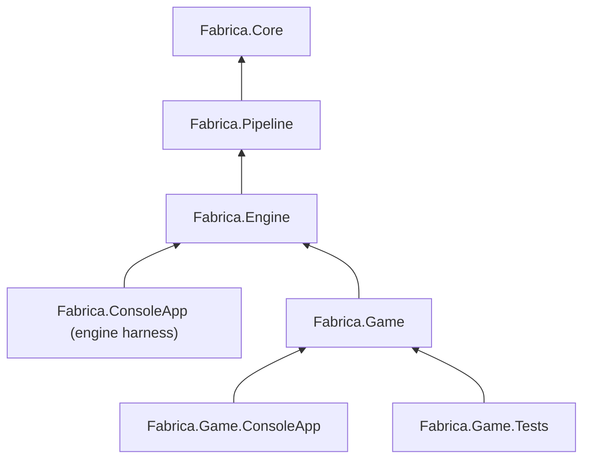
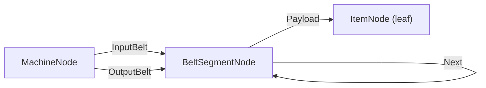
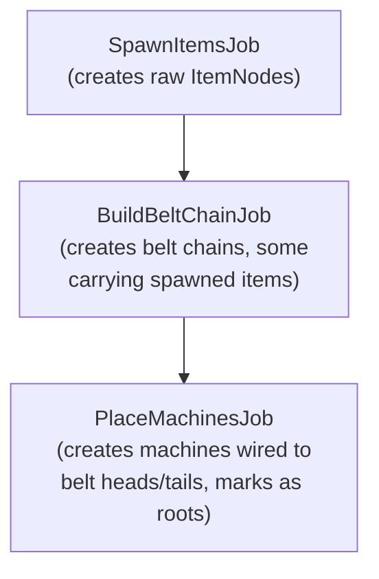

# Barebone game project structure

## Dependency graph after this change

`Fabrica.ConsoleApp` stays as-is (engine-only harness). The game gets its own executable.

## New projects

### 1. `src/Fabrica.Game/Fabrica.Game.csproj`

Library. References `Fabrica.Engine`. Contains:

#### Node types (3 structs, cross-type handles)

- `**ItemNode**` (leaf, no children):
  - `int ItemTypeId` — what kind of item (iron ore, copper plate, gear, etc.)
- `**BeltSegmentNode**` (same-type chain + cross-type child):
  - `Handle<BeltSegmentNode> Next` — next segment in the belt chain (same-type)
  - `Handle<ItemNode> Payload` — item being carried, or `Handle.None` if empty
- `**MachineNode**` (cross-type parent referencing belts):
  - `Handle<BeltSegmentNode> InputBelt` — belt segment it pulls items from
  - `Handle<BeltSegmentNode> OutputBelt` — belt segment it pushes items to
  - `int RecipeId` — which recipe is running
  - `int Progress` — ticks of progress on current recipe

This exercises: same-type chaining (belt `Next`), cross-type parent-child at two levels (machine -> belt -> item), and leaf nodes with no children.

#### GameNodeOps

Single struct implementing `INodeOps<MachineNode>`, `INodeOps<BeltSegmentNode>`, and `INodeOps<ItemNode>`. The `INodeVisitor.Visit<T>` dispatch uses `typeof` checks with JIT dead-branch elimination (same pattern as `CrossTypeSnapshotTests`). Two-phase init captures references to all three `GlobalNodeStore` instances.

#### Jobs (3 classes, DAG dependencies)

- `**SpawnItemsJob : Job**` (no deps) — allocates N `ItemNode`s with varying `ItemTypeId`s. Stores allocated handles in a field for downstream jobs to consume.
- `**BuildBeltChainJob : Job**` (depends on SpawnItemsJob) — creates chains of `BeltSegmentNode`s linked via `Next`. Some segments carry items from the spawn job (`Payload` = cross-TLB handle). Stores chain head/tail handles for the machine job.
- `**PlaceMachinesJob : Job**` (depends on BuildBeltChainJob) — creates `MachineNode`s, wires `InputBelt`/`OutputBelt` to belt chain endpoints. Marks each machine as a root via `tlb.MarkRoot(...)`. All belt segments and items become reachable through the machine roots.

#### GameWorldImage

Game-specific payload type (replaces the engine's empty `WorldImage`). Holds `SnapshotSlice` for each of the three node types. Implements pooling via nested `Allocator : IAllocator<GameWorldImage>`.

#### GameProducer : IProducerGameWorldImage

Like `SimulationProducer` but aware of the game's concrete types. Each `Produce` call:

1. Resets per-worker TLBs for all three node types
2. Builds the 3-job DAG (SpawnItems -> BuildBelts -> PlaceMachines)
3. Submits via `JobScheduler` (blocks until complete)
4. Calls `store.DrainBuffers(...)` on all three stores (barrier)
5. Calls `store.RewriteAndIncrementRefCounts(...)` on all three stores
6. Calls `store.CollectAndRemapRoots(...)` + `store.IncrementRoots(...)` for machine store (machines are the only roots)
7. Populates snapshot slices on the `GameWorldImage`

#### GameEngine

Factory (like `[SimulationEngine](src/Fabrica.Engine/Hosting/SimulationEngine.cs)`) that creates the three `GlobalNodeStore` instances, `GameNodeOps` with two-phase init, `WorkerPool`, `JobScheduler`, and returns a `Host<GameWorldImage, GameProducer, ...>`.

### 2. `src/Fabrica.Game.ConsoleApp/Fabrica.Game.ConsoleApp.csproj`

Executable. References `Fabrica.Game`. Thin entry point that calls `GameEngine.Create(...)` and `RunAsync`. Nearly identical to `[Fabrica.ConsoleApp/Program.cs](src/Fabrica.ConsoleApp/Program.cs)` but using the game types.

### 3. `tests/Fabrica.Game.Tests/Fabrica.Game.Tests.csproj`

Test project. References `Fabrica.Game`. At minimum one end-to-end test that:

1. Creates all three `GlobalNodeStore` instances with `GameNodeOps`
2. Creates TLBs, builds the 3-job DAG, runs via `JobScheduler` on a real `WorkerPool`
3. Runs the full merge pipeline (drain -> rewrite+refcount -> roots)
4. Validates with `DagValidator` (all machines are roots, all belt segments and items reachable)
5. Decrements roots and verifies cascade-free empties all three arenas

## Visibility

**Rules:**

- No `InternalsVisibleTo` between production assemblies
- IVT from any library to any test project is allowed

**Promote to `public`** (game production code directly uses these):

Fabrica.Core/Memory:

- `INodeOps<TNode>` — game implements this
- `INodeVisitor` — game's visitor structs implement this
- `GlobalNodeStore<TNode, TNodeOps>` — game creates stores, calls merge methods (already public, but needs a new public parameterless constructor since the 3-arg constructor takes internal types)
- `ThreadLocalBuffer<T>` — jobs call `Allocate()`, `MarkRoot()`, index into it
- `RemapTable` — game producer passes to `DrainBuffers`, game visitors resolve through it
- `TaggedHandle` — game visitors decode local handles via `IsLocal`/`DecodeThreadId`/`DecodeLocalIndex`
- `UnsafeList<T>` — game uses for root collection (passed to `CollectAndRemapRoots`)
- `SnapshotSlice<TNode, TNodeOps>` — game world image holds these

Fabrica.Core/Jobs:

- `Job` — game defines job subclasses
- `JobScheduler` — game producer submits jobs
- `WorkerPool` — game engine factory creates the pool
- `WorkerContext` — `Job.Execute(WorkerContext)` signature

Fabrica.Engine:

- `IRenderer` — game engine factory generic constraint (already public)
- `RenderConsumer<TRenderer>` — game engine factory constructs the consumer

**Stay `internal`** (game tests access via IVT, game production code doesn't need):

- `UnsafeSlabArena<T>` — implementation detail of `GlobalNodeStore`
- `RefCountTable<T>` — implementation detail of `GlobalNodeStore`
- `DagValidator` — only tests use this for validation
- `SimulationConstants` — game defines its own tick rates

`**GlobalNodeStore` constructor change:**
The current primary constructor takes `(UnsafeSlabArena<T>, RefCountTable<T>, TNodeOps)`. Since arena/refcount stay internal, the game can't call it. Convert to a regular class with:

- `internal GlobalNodeStore(UnsafeSlabArena<T> arena, RefCountTable<T> refCounts, TNodeOps nodeOps)` — used by existing tests (via IVT)
- `public GlobalNodeStore()` — creates its own arena and refcount table; used by game code

Make `Arena` and `RefCounts` properties `internal` (they return internal types). Existing tests access them via IVT.

**Already public** (no changes needed):

- `Handle<T>` (Core), `IAllocator<T>`, `ObjectPool<T, TAllocator>` (Core)
- `IProducer<TPayload>`, `Host`, `SharedPipelineState`, `ProductionLoop`, `ConsumptionLoop`, `PipelineConfiguration`, `PipelineEntry`, `IDeferredConsumer` (Pipeline)
- `IRenderer` (Engine)

**IVT additions:**

- `Fabrica.Core` adds IVT to `Fabrica.Game.Tests` (access `Arena`, `RefCounts`, `DagValidator`, etc.)
- `Fabrica.Engine` adds IVT to `Fabrica.Game.Tests` (access engine internals if needed)
- `Fabrica.Game` adds IVT to `Fabrica.Game.Tests` (access game internals)

## What this does NOT include yet

- Source generators (the per-type boilerplate in `GameNodeOps` / visitors is hand-written for now — exactly the kind of thing SGs will eliminate later)
- Real game logic (belt transport, machine state) — just enough structure to prove the pipeline
- Consumption-side wiring (snapshot retirement, root decrement on release)

