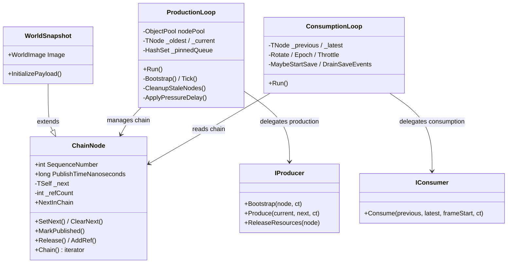

# Generic Producer/Consumer Pipeline

## Current State

The engine has three core loops (`SimulationLoop`, `ConsumptionLoop`, `Engine`) that are generic on clock/waiter/saver/renderer but **hardcoded** to `WorldSnapshot`, `WorldImage`, `MemorySystem`, `SimulationCoordinator`, and `RenderCoordinator`. The goal is to make these loops agnostic of the domain types — turning them into a reusable lock-free producer/consumer pipeline with epoch-based reclamation, safe ref-counting, pinning, and backpressure.

## Architecture After Refactoring




## PR 1 — Extract `ChainNode<TSelf>` from `WorldSnapshot`

Pure structural refactoring. No behavior change, no new generic params on loops.

**New file: `Simulation/World/ChainNode.cs`**

CRTP base class that absorbs all chain/epoch/ref-counting mechanics from `WorldSnapshot`:

- `SequenceNumber` (renamed from `TickNumber` on the base; `WorldSnapshot` keeps `TickNumber` as `=> this.SequenceNumber`)
- `PublishTimeNanoseconds`
- Private `_next` field + `NextInChain` accessor
- `SetNext`, `ClearNext`, `MarkPublished`
- `_refCount`, `AddRef`, `Release`, `IsUnreferenced`
- `InitializeBase(int sequenceNumber)` — sets sequence, clears next, sets refcount=1
- `Chain(start, end)` static method + nested `ChainSegment<TSelf>` struct iterator (lifted from `WorldSnapshot.SnapshotChain`, generalized to `TSelf`)

**Modified: `WorldSnapshot`**

```csharp
internal sealed class WorldSnapshot : ChainNode<WorldSnapshot>
{
    public WorldImage Image { get; private set; } = null!;
    public int TickNumber => this.SequenceNumber;

    internal void Initialize(WorldImage image, int tickNumber)
    {
        this.InitializeBase(tickNumber);
        this.Image = image;
    }

    // Release override to null out Image when refcount hits 0
    internal new void Release() { base.Release(); if (this.IsUnreferenced) this.Image = null!; }
}
```

**Updated callers** (no logic changes):

- `SimulationLoop` — already uses `NextInChain`, `SetNext`, `ClearNext`, `MarkPublished`, `Release`; all move to base class. `snapshot.TickNumber` still works via the alias.
- `ConsumptionLoop` — uses `.TickNumber` (alias works) and `RenderFrame.Chain` (now calls `ChainNode<WorldSnapshot>.Chain`)
- `SharedState` — still typed `WorldSnapshot?`; unchanged in this PR
- All tests — `.TickNumber` alias means minimal changes. `WorldSnapshotTests` may split into `ChainNodeTests` + `WorldSnapshotTests`.
- `RenderFrame.Chain` — calls the generalized `ChainNode<WorldSnapshot>.Chain`

**Key decisions:**

- `ChainSegment<TSelf>` replaces `SnapshotChain` — same zero-allocation struct iterator, just generic
- `SequenceNumber` is the generic name; `TickNumber` on `WorldSnapshot` is a domain alias
- The `Release()` behavior (nulling payload fields) uses a virtual or overridable pattern — simplest: `ChainNode<TSelf>` calls `OnReleased()` virtual method, `WorldSnapshot` overrides to null `Image`

---

## PR 2 — Parameterize loops, SharedState, Engine with generic interfaces

This is the main refactoring. Introduces generic interfaces and makes all core types parametric.

**New interfaces:**

- `**IProducer<TNode>`** (`struct` constraint for devirtualization)
  - `void Bootstrap(TNode node, CancellationToken ct)` — fill the initial node
  - `void Produce(TNode current, TNode next, CancellationToken ct)` — produce next from current
  - `void ReleaseResources(TNode node)` — called when the loop frees a node (return payload to pool, etc.)
- `**IConsumer<TNode>**` (`struct` constraint)
  - `void Consume(TNode? previous, TNode latest, long frameStartNanoseconds, CancellationToken ct)` — handle the frame (build render data, dispatch to workers, render)
- `**ISaver<TNode>**` — replaces current `ISaver` (takes `WorldImage`)
  - `void Save(TNode node, int sequenceNumber)` — the implementation extracts whatever payload it needs
- `**ISaveRunner<TNode>**` — replaces current `ISaveRunner`
  - `void RunSave(TNode node, int sequenceNumber, Action<TNode, int> saveAction)`

**Modified types:**

- `**SharedState<TNode>`** — `LatestSnapshot` becomes `LatestNode` of type `TNode?`; `ConsumptionEpoch` and `NextSaveAtTick` stay as `int`. Initial `NextSaveAtTick` value moves to a constructor param (no more `SimulationConstants` dependency).
- `**ProductionLoop<TNode, TProducer, TClock, TWaiter>**` (renamed from `SimulationLoop`)
  - Fields: `ObjectPool<TNode>` (replaces `MemorySystem` for node pooling), `SharedState<TNode>`, `TProducer`, `PinnedVersions`
  - `Bootstrap()` → rents node, calls `_producer.Bootstrap(node, ct)`, publishes
  - `Tick()` → rents node, calls `InitializeBase`, calls `_producer.Produce(current, next, ct)`, links chain, publishes
  - `FreeNode()` → calls `_producer.ReleaseResources(node)`, `node.Release()`, returns to pool
  - Cleanup and backpressure logic unchanged (already generic over sequence numbers)
- `**ConsumptionLoop<TNode, TConsumer, TSaveRunner, TSaver, TClock, TWaiter>**`
  - Rotation, epoch, throttle: unchanged (already generic — just `TNode` fields)
  - Rendering: delegates to `_consumer.Consume(previous, latest, frameStart, ct)` instead of building `RenderFrame` + calling `IRenderer`
  - Saving: `MaybeStartSave(TNode)` pins by `node.SequenceNumber`, calls `_saveRunner.RunSave(node, seq, ...)`. `RunSaveTask` calls `_saver.Save(node, seq)` then unpins.
- `**Engine<TNode, TProducer, TConsumer, TSaveRunner, TSaver, TClock, TWaiter>**`
  - 7 type params (was 5). `Create()` hides the complexity at the call site.

**New domain-specific implementations** (replace what's currently baked into the loops):

- `**SimulationProducer`** : `IProducer<WorldSnapshot>` — owns `ObjectPool<WorldImage>`, `SimulationCoordinator`. `Bootstrap` and `Produce` rent images, call coordinator, call `snapshot.Initialize(image, tick)`. `ReleaseResources` returns image to pool.
- `**SimulationConsumer<TRenderer>**` : `IConsumer<WorldSnapshot>` — owns `RenderCoordinator`, `TRenderer`. Builds `RenderFrame`, dispatches to render workers, calls renderer. (Absorbs `RenderFrame` building from the old consumption loop.)
- `**SimulationSaver<TSaver>**` : `ISaver<WorldSnapshot>` — delegates to inner `TSaver : ISaver` which takes `WorldImage`. Bridges old `ISaver.Save(WorldImage, int)` to new `ISaver<WorldSnapshot>.Save(WorldSnapshot, int)`.

`**MemorySystem` simplification**: After this refactoring, `MemorySystem` is no longer needed as a unified type. The node pool lives on `ProductionLoop`; the image pool lives on `SimulationProducer`; `PinnedVersions` is passed directly. `MemorySystem` can be removed or reduced to a thin wrapper.

`**RenderFrame`**: Stays as a domain-specific type in the `Simulation.Engine` namespace. It's no longer constructed by the generic loop — it's constructed by `SimulationConsumer.Consume()`. The `IRenderer` interface also stays domain-specific.

**Test impact**: All test files that construct loops/engine will need updated type params. Test doubles (`TestRecordingSaver`, etc.) implement the new generic interfaces. The `ConsumptionLoopTestContext.CreatePublishedSnapshot` changes to use `ChainNode` base class methods.

**Timing constants**: The generic loops should not reference `SimulationConstants` directly. Instead, introduce a `PipelineConfig` struct (or pass individual values) for tick duration, render interval, backpressure thresholds, save interval, pool sizes. `SimulationConstants` becomes a factory for the game-specific config. (This can be a sub-task of PR 2 or a follow-up PR if PR 2 is already large.)

---

## Namespace and folder organization

- `Simulation/Engine/Pipeline/` — generic types: `ChainNode<T>`, `ProductionLoop`, `ConsumptionLoop`, `SharedState<T>`, `IProducer`, `IConsumer`, `ISaver<T>`, `ISaveRunner<T>`, `PipelineConfig`
- `Simulation/Engine/Simulation/` — domain-specific: `SimulationProducer`, `SimulationCoordinator`, `SimulationExecutor`, `WorkerResources`
- `Simulation/Engine/Rendering/` — domain-specific: `SimulationConsumer`, `RenderCoordinator`, `RenderExecutor`, `RenderFrame`, `IRenderer`
- `Simulation/Engine/` — `Engine` (top-level wiring), `ConsoleRenderer`, `ConsoleSaver`, etc.

