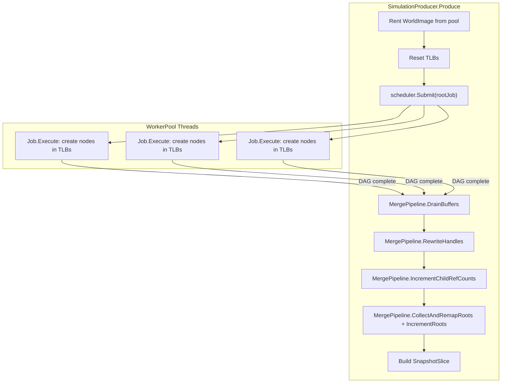

# Job DAG Wiring

## Current State

- **Job system** (`Job`, `JobScheduler`, `WorkerPool`, `WorkerContext`, `WorkStealingDeque`) is fully implemented in `Fabrica.Core/Jobs` but NOT used by `Fabrica.Engine`.
- **Merge pipeline** (3 phases + root collection) exists only as private test helpers in `[CoordinatorMergeTests.cs](tests/Fabrica.Core.Tests/Memory/CoordinatorMergeTests.cs)`.
- **SimulationCoordinator** uses `WorkerGroup` (fixed-partition barrier model) which predates the job system. It is a thin wrapper whose logic can fold into `SimulationProducer`.
- **SimulationProducer** is a `readonly struct` implementing `IProducer<WorldImage>` (struct-constrained by `ProductionLoop` for devirtualization). It currently delegates to `SimulationCoordinator`.
- **WorkerGroup** remains needed for `RenderCoordinator` -- not deleted.

## Architecture

Jobs access per-worker `ThreadLocalBuffer<T>` arrays via `context.WorkerIndex`. Job subclasses carry references to shared tick resources (TLB arrays, NodeStores) in their fields -- this keeps `WorkerContext` generic.

## Step 1: Move merge helpers to production code

Create `[src/Fabrica.Core/Memory/MergePipeline.cs](src/Fabrica.Core/Memory/MergePipeline.cs)` with `internal static` methods lifted from `CoordinatorMergeTests`:

- `MergePipeline.DrainBuffers<TNode>(arena, refCounts, tlbs, remap)` -- allocate batch from arena, copy from TLBs, build remap table. Returns `(int start, int count)`.
- `MergePipeline.RewriteHandles<TNode, TNodeOps, TVisitor>(arena, start, count, ref ops, ref visitor)` -- enumerate children of newly merged nodes, rewrite local handles to global via RemapVisitor.
- `MergePipeline.IncrementChildRefCounts<TNode, TNodeOps, TVisitor>(arena, start, count, ref ops, ref visitor)` -- enumerate children of newly merged nodes, increment refcounts via RefcountVisitor.
- `MergePipeline.CollectAndRemapRoots<TNode>(tlbs, remap)` -- gather roots from all TLBs, remap local handles to global, return `Handle<TNode>[]`.

Update `[CoordinatorMergeTests.cs](tests/Fabrica.Core.Tests/Memory/CoordinatorMergeTests.cs)` to call through `MergePipeline` instead of its private copies and delete the private helpers.

## Step 2: End-to-end integration test

New test class `[JobMergePipelineTests.cs](tests/Fabrica.Core.Tests/Memory/JobMergePipelineTests.cs)` that proves the full production-side pipeline using the real job system:

1. Create `WorkerPool` + `JobScheduler`
2. Define concrete test `Job` subclasses (`CreateChildNodesJob`, `CreateParentNodesJob`) that allocate nodes in TLBs and mark roots
3. Wire them as a DAG (child-creation jobs feed into parent-creation jobs)
4. `scheduler.Submit(rootJob)` -- runs on real worker threads with work-stealing
5. After completion, call `MergePipeline.DrainBuffers` / `RewriteHandles` / `IncrementChildRefCounts`
6. Validate with `DagValidator.AssertValid`
7. Verify cascade-free via `NodeStore.DecrementRoots`

This proves: parallel job execution on work-stealing threads -> per-worker TLBs with correct threadId -> merge with remap -> correct refcounts.

## Step 3: Fold SimulationCoordinator into SimulationProducer

`SimulationProducer` absorbs the coordinator's responsibilities directly. With `JobScheduler.Submit`, the orchestration is simple enough to live in `Produce`:

- `[SimulationProducer.cs](src/Fabrica.Engine/Simulation/SimulationProducer.cs)`: holds references to `WorkerPool`, `JobScheduler`, image pool, NodeStores, TLB arrays. `Produce` = rent image, reset TLBs, build job DAG, submit, merge, build snapshot.
- Since `WorldImage` has no real node types yet, the merge phase will be a TODO comment where concrete types plug in later (the integration test in Step 2 proves the pipeline works).
- Delete the following files (all replaced by `SimulationProducer` + `Job` subclasses):
  - `[SimulationCoordinator.cs](src/Fabrica.Engine/Simulation/SimulationCoordinator.cs)`
  - `[SimulationCoordinator.SimulationExecutor.cs](src/Fabrica.Engine/Simulation/SimulationCoordinator.SimulationExecutor.cs)`
  - `[SimulationTickState.cs](src/Fabrica.Engine/Simulation/SimulationTickState.cs)`
  - `[WorkerResources.cs](src/Fabrica.Engine/Simulation/WorkerResources.cs)`
- Update `[SimulationEngine.cs](src/Fabrica.Engine/Hosting/SimulationEngine.cs)` to create `WorkerPool` + `JobScheduler` and pass them into `SimulationProducer`.

`WorkerGroup` stays -- `RenderCoordinator` still uses it.

## Key design note: work stealing and TLB threadId

When a job is stolen, it executes on the stealing worker's thread. `context.WorkerIndex` is the **executing** worker's index, which is the correct threadId for `ThreadLocalBuffer`. This is safe because:

- TLBs are append-only during the work phase (no shared mutation)
- Each worker exclusively owns its TLBs
- `TaggedHandle.EncodeLocal(threadId, localIndex)` correctly identifies which TLB a handle came from
- The merge's `RemapTable` is indexed by threadId, matching the TLB arrays

