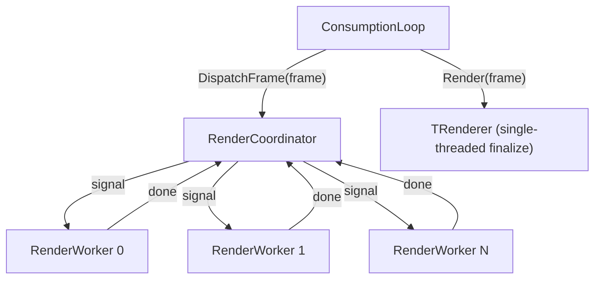

# Multi-threaded Rendering

## Design

Mirror the simulation worker pattern exactly:

The consumption loop calls `RenderCoordinator.DispatchFrame()` (parallel work), then `_renderer.Render()` (single-threaded finalization) — same two-step pattern as simulation where `Simulator.AdvanceTick()` precedes the loop's own cleanup/pressure logic.

## New files

- `**Simulation/Engine/RenderWorker.cs**` — mirrors `[SimulationWorker.cs](Simulation/Engine/SimulationWorker.cs)`
  - Long-lived background thread with park/signal loop (`AutoResetEvent` go/done)
  - Thread pinning via `ThreadPinning.TryPinCurrentThread(coreOffset + workerIndex)`
  - `RenderFrame` + `CancellationToken` written by coordinator before `Signal()`
  - `ExecuteRender()` stub (TODO: actual per-worker render logic)
  - `Shutdown()`, `Join()`, `Cleanup()` lifecycle methods
- `**Simulation/Engine/RenderWorkerResources.cs**` — mirrors `[WorkerResources.cs](Simulation/Engine/WorkerResources.cs)`
  - Future: per-worker render buffers, draw command lists
  - `PrepareForFrame()` clears per-frame state
- `**Simulation/Engine/RenderCoordinator.cs**` — mirrors `[Simulator.cs](Simulation/Engine/Simulator.cs)`
  - Constructor: `(int workerCount, int coreOffset = 0)` — core offset avoids overlapping thread pins with simulation workers
  - `DispatchFrame(in RenderFrame frame, CancellationToken ct)`: prepare workers, set up frame data, signal all, `WaitHandleBatch.WaitAll()` to join
  - `IDisposable`: shutdown, join, cleanup (same pattern as `Simulator.Dispose()`)
  - Reuses existing `WaitHandleBatch` and `ThreadPinning`

## Modified files

- `**[ConsumptionLoop.cs](Simulation/Engine/ConsumptionLoop.cs)**` — add optional `RenderCoordinator?` constructor parameter (default `null`)
  - In `RunOneIteration`, before `_renderer.Render(in frame)`, call `_renderCoordinator?.DispatchFrame(in frame, cancellationToken)`
  - Tests are unchanged (pass no coordinator, parallel dispatch is skipped)
- `**[Engine.cs](Simulation/Engine/Engine.cs)**` — own and dispose `RenderCoordinator`
  - `Create()` gains a `renderWorkerCount` parameter; builds coordinator with `coreOffset: simulationWorkerCount`
  - `Run()` disposes both `Simulator` and `RenderCoordinator` in `finally`
- `**[TODO.md](TODO.md)**` — mark the multi-threaded rendering item as completed; the thread pinning item for render workers is already covered by the existing macOS/64-core TODOs

