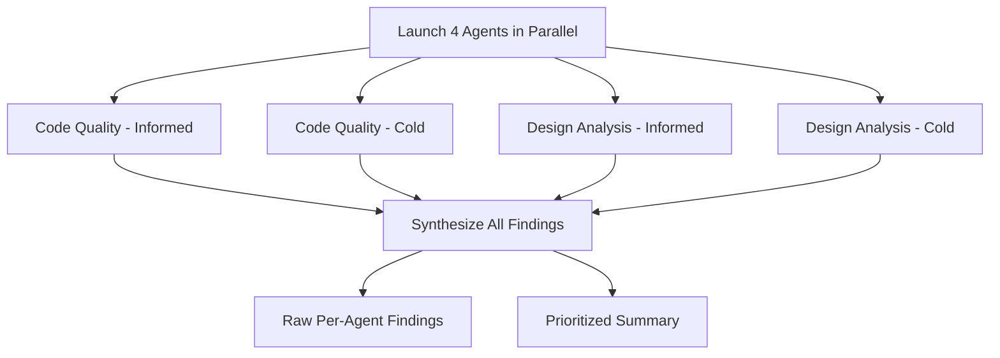

# Deep Codebase Review: Informed vs. Cold Analysis

## Approach

Four agents run in parallel against `Engine/` production code only. Each pair has one **informed** agent (briefed on architecture) and one **uninformed** agent (reads code cold). All agents are explicitly told to prioritize depth and quality over speed, and may spawn sub-agents for focused investigation of specific areas.

## Step 0: Pull latest master

Merge PR #40 into local master before launching agents.

## Step 1: Launch 4 agents in parallel

### Agent 1 — Code Quality (Informed)

Briefed on:

- Two-thread lock-free producer/consumer pipeline (`ProductionLoop` / `ConsumptionLoop`)
- Forward-linked `ChainNode` chain with epoch-based reclamation
- Generic struct strategy (all hot-path interfaces constrained to `struct` for JIT specialization)
- `#if DEBUG` / `PrivateChainNode` encapsulation pattern
- `WorkerGroup` parallel dispatch cycle (prepare/signal/join)
- `SharedPipelineState` as the volatile bridge between threads
- `PinnedVersions` for deferred consumer lifetime extension
- `SimulationPressure` back-pressure system
- `ObjectPool` with `default(TAllocator)` stateless allocator pattern

Tasked with: reviewing every file in `Engine/` for correctness, naming consistency, code smells, dead code, missing edge cases, error handling gaps, and whether the implementation faithfully serves the stated design goals.

### Agent 2 — Code Quality (Cold)

Given NO architectural context. Told only: "This is a C# .NET game engine. Read every file in `Engine/`. Form your own understanding, then critique code quality — naming, structure, consistency, potential bugs, dead code, confusing patterns, anything that doesn't make sense to a fresh reader."

### Agent 3 — Design Analysis (Informed)

Same architectural briefing as Agent 1, but tasked with a different goal: deeply analyze the **architecture and design tradeoffs**. Specifically:

- Is the lock-free two-thread model sound? Are there ordering/visibility bugs?
- Does epoch-based reclamation actually prevent use-after-free in all scenarios?
- Is the generic struct strategy worth the complexity it adds?
- Does the `#if DEBUG` / `PrivateChainNode` pattern achieve its encapsulation goals?
- Is the back-pressure system well-calibrated?
- Are there simpler alternatives that would achieve the same goals?
- What breaks first as the system scales (more workers, larger snapshots, more deferred consumers)?

### Agent 4 — Design Analysis (Cold)

Given NO architectural context. Told only: "This is a C# .NET game engine. Read every file in `Engine/`. Reverse-engineer the architecture. Then provide your deep analysis of whether the design is sound, what the tradeoffs are, what could be simplified, and what will cause problems at scale."

### Common instructions for all 4 agents

- **Take as much time as you need. Quality and depth are far more important than speed.** Read every file thoroughly. Re-read files if something doesn't add up. Spawn sub-agents to investigate specific subsystems if that helps you go deeper.
- Focus on `Engine/` only (not `Engine.Tests/`).
- Be genuinely critical. Don't be polite about problems.
- Organize findings by severity (critical / important / minor / nitpick).

## Step 2: Synthesize results

After all 4 agents return:

1. Present each agent's raw findings separately (labeled by role)
2. Synthesize a single prioritized summary that highlights where agents **agree** (high-confidence findings) and where they **disagree** (areas worth discussing)

## Future follow-up (not part of this plan)

A separate web research agent will investigate prior art and literature on decoupled production/consumption pipelines with immutable snapshots — whether this pattern has been tried, known pros/cons, and relevant references. This will be launched separately to avoid blocking the 4 review agents.