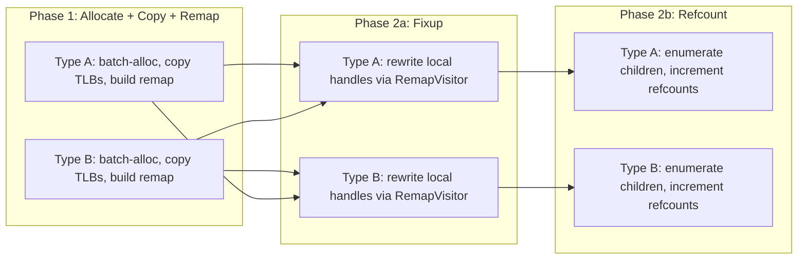

# Coordinator Merge Pipeline

## Architecture

After the production job DAG completes, the coordinator runs a 3-phase merge to move thread-local nodes into the global arenas:




Phase 1 is parallel-by-type (no cross-type dependency). Phase 2a has a barrier: ALL types must finish Phase 1 before ANY type starts 2a (because fixup for type A needs type B's remap table). Phase 2b can start per-type as soon as that type's fixup completes.

## Key Design Decisions

### RemapTable: non-generic, `UnsafeList<int>[]` storage, poolable

- **Storage**: `UnsafeList<int>[]` indexed by `[threadId]`. Outer array is fixed-size (worker count). Inner lists grow with TLB usage and `Reset()` without releasing backing arrays.
- **Non-generic**: The remap data is just `(threadId, localIndex) -> globalIndex` -- independent of node type. This enables a single pool of `RemapTable` instances shared across all types and ticks.
- **Reuse**: Coordinator holds remap tables directly (one per node type, allocated once). Each tick calls `Reset()` for zero steady-state allocation.
- File: new `src/Fabrica.Core/Memory/RemapTable.cs`

```csharp
internal sealed class RemapTable
{
    private readonly UnsafeList<int>[] _remap;
    
    internal RemapTable(int threadCount) { ... }
    
    public void SetMapping(int threadId, int localIndex, int globalIndex) { ... }
    public int Resolve(int threadId, int localIndex) => _remap[threadId][localIndex];
    public void Reset() { /* resets all inner lists */ }
}
```

### AllocateBatch on UnsafeSlabArena

- Bumps `_highWater` by `count`, ensures slabs, returns starting index.
- Deliberately bypasses the free list: batch allocation needs contiguous indices for bulk copy.
- Free list entries accumulate but this is acceptable for the initial implementation (future optimization can drain free list first).
- Added to existing `[src/Fabrica.Core/Memory/UnsafeSlabArena.cs](src/Fabrica.Core/Memory/UnsafeSlabArena.cs)`

### Root Tracking: deferred

- The merge pipeline does NOT integrate with `SnapshotSlice` yet.
- **Likely approach** (for future PR): Jobs explicitly mark root handles at creation time via a `RootCollector` buffer. After merge, the coordinator remaps root handles and feeds them into `SnapshotSlice.AddRoot`.
- **Why not refcount-zero**: A zero refcount could be a bug; we should not elevate it to a root. Instead, debug-assert that all roots have refcount zero and no non-roots have refcount zero.
- **Why not root-job-output**: Pushes responsibility too far from the creation point. Jobs know at creation time what they're making.
- A TODO item is added to `TODO.md` capturing this decision.

### Visitors

Both visitors are struct implementations of `INodeVisitor`, following the established `typeof` dispatch pattern from `[CrossTypeSnapshotTests.cs](tests/Fabrica.Core.Tests/Memory/CrossTypeSnapshotTests.cs)` and `[HandleRewriterTests.cs](tests/Fabrica.Core.Tests/Memory/HandleRewriterTests.cs)`.

**RemapVisitor** (`VisitRef<T>`): Receives `ref Handle<T>`, decodes `(threadId, localIndex)` from the tagged handle, looks up the correct per-type `RemapTable`, rewrites to global index. Skips global and None handles. Uses `EnumerateRefChildren` path.

**RefcountVisitor** (`Visit<T>`): Receives `Handle<T>` by value, dispatches via `typeof(T)` to the correct `NodeStore.IncrementRefCount`. Uses `EnumerateChildren` (read-only) path.

### Test Structure

A new `CoordinatorMergeTests.cs` in `tests/Fabrica.Core.Tests/Memory/` with a 2-type cross-thread scenario:

- 2 worker threads, each creating `ParentNode` and `ChildNode` entries in TLBs
- Run all 3 merge phases
- Verify: global arena contents match TLB data, all handles are global, refcounts match expected values, `DagValidator.AssertValid` passes

## Files Changed

- `src/Fabrica.Core/Memory/UnsafeSlabArena.cs` -- add `AllocateBatch(int count)`
- `src/Fabrica.Core/Memory/RemapTable.cs` -- new file
- `tests/Fabrica.Core.Tests/Memory/CoordinatorMergeTests.cs` -- new file (merge phases + end-to-end test)
- `TODO.md` -- add root tracking TODO

## Deferred

- Job DAG wiring (merge phases as `Job` subclasses on `WorkerPool`) -- optional follow-up
- Root tracking / `SnapshotSlice` integration
- Source generator for merge boilerplate
- Free list draining during batch allocation

