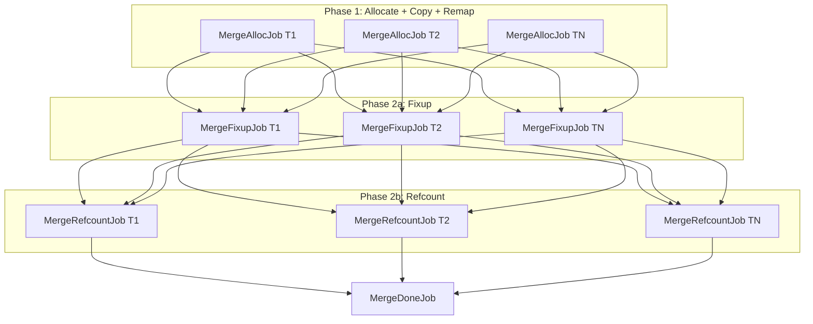

# Coordinator Merge Pipeline

## Context

After production jobs finish, each worker's `ThreadLocalBuffer<T>` (one per type) contains newly-created nodes with local handles. The coordinator must merge these into global `NodeStore` arenas, rewrite local handles to global, and update refcounts. The merge runs as a 3-phase job DAG on the existing `WorkerPool`.

## Phase Architecture




Each Phase 2a job depends on ALL Phase 1 jobs (cross-type remap tables needed). Each Phase 2b job depends on ALL Phase 2a jobs (handles must be global before counting). The coordinator submits the DAG root(s) and waits on `MergeDoneJob`.

## What Each Phase Does

**Phase 1 (per type T):** Iterate all M workers' `ThreadLocalBuffer<T>`. For each TLB: allocate N global slots from T's `UnsafeSlabArena`, copy node data, record `remap[threadId][localIndex] = globalIndex`. Writes only to T's arena.

**Phase 2a (per parent type P):** Walk all newly-merged nodes of type P. For each node, call `EnumerateRefChildren` with a `RemapVisitor` that replaces local handles with global handles using the remap tables. Writes only to P's arena (in-place mutation of child handle fields).

**Phase 2b (per child type T):** Walk all newly-merged nodes of ALL parent types that reference T. For each child handle of type T encountered, increment T's `RefCountTable`. Writes only to T's `RefCountTable`.

## New Types

### `RemapTable` (`src/Fabrica.Core/Memory/RemapTable.cs`)

Holds `int[][] _remap` indexed by `[threadId][localIndex]`. Built during Phase 1. Read during Phase 2a.

- `SetMapping(int threadId, int localIndex, int globalIndex)`
- `Resolve(int encodedLocalHandle) -> int globalIndex`
- One `RemapTable` per node type (each type has its own remap)

### `RemapVisitor` (struct, implements `INodeVisitor`)

Used in Phase 2a fixup. For each `VisitRef<T>(ref Handle<T> handle)`, checks `TaggedHandle.IsLocal`, decodes thread ID, looks up the correct type's `RemapTable`, and rewrites the handle. Needs access to remap tables for ALL types (since a ParentNode may have `Handle<ChildNode>` fields pointing into ChildNode's remap).

```csharp
// Conceptual — the actual shape depends on how many types exist
struct RemapVisitor : INodeVisitor
{
    void VisitRef<T>(ref Handle<T> handle) where T : struct
    {
        if (TaggedHandle.IsLocal(handle.Index))
        {
            var threadId = TaggedHandle.DecodeThreadId(handle.Index);
            var localIdx = TaggedHandle.DecodeLocalIndex(handle.Index);
            var remap = GetRemapForType<T>(); // typeof dispatch
            handle = new Handle<T>(remap.Resolve(threadId, localIdx));
        }
    }
}
```

This is where the per-type boilerplate appears — the `GetRemapForType<T>()` dispatch needs a typeof switch over all known types, exactly the pattern INodeOps uses today.

### `RefcountVisitor` (struct, implements `INodeVisitor`)

Used in Phase 2b. For each `Visit<T>(Handle<T> handle)`, increments T's `RefCountTable`. Again, typeof dispatch to the correct table.

### `UnsafeSlabArena<T>.EnsureCapacity(int count)`

The arena currently has single `Allocate()`. For Phase 1 we need to efficiently allocate N contiguous slots. Add a method that bumps `_highWater` by `count` (ensuring slabs exist) and returns the starting index. The free list is bypassed for batch allocation — newly-merged nodes always get fresh indices.

- `int AllocateBatch(int count)` — returns starting global index, ensures slabs, bumps `_highWater` and `_count`

## Manual Wiring (Pre-Source-Generator)

Without the source generator, the test must manually:

1. Create `ThreadLocalBuffer<ParentNode>` and `ThreadLocalBuffer<ChildNode>` per worker
2. Create the `RemapVisitor` with typeof dispatch for both types
3. Create the `RefcountVisitor` with typeof dispatch for both types
4. Wire up the 3-phase DAG with the correct dependencies

This is intentionally manual and repetitive — it directly demonstrates the boilerplate that the source generator will eliminate.

## Test Strategy

Build an end-to-end test in a new `CoordinatorMergeTests.cs` using the existing `ParentNode`/`ChildNode` types from `CrossTypeSnapshotTests`:

1. Create N workers' TLBs, populate with a cross-type DAG (parents referencing children, including cross-thread references)
2. Run the 3-phase merge (can be sequential for the first test, then a parallel variant using `JobScheduler`)
3. Verify: all nodes in global arenas, all handles are global, refcounts correct, `DagValidator` passes

## Key Files

- [src/Fabrica.Core/Memory/RemapTable.cs](src/Fabrica.Core/Memory/RemapTable.cs) — new
- [src/Fabrica.Core/Memory/UnsafeSlabArena.cs](src/Fabrica.Core/Memory/UnsafeSlabArena.cs) — add `AllocateBatch`
- [src/Fabrica.Core/Memory/NodeStore.cs](src/Fabrica.Core/Memory/NodeStore.cs) — may need a `MergeFromTLBs` helper or similar
- [tests/Fabrica.Core.Tests/Memory/CoordinatorMergeTests.cs](tests/Fabrica.Core.Tests/Memory/CoordinatorMergeTests.cs) — new
- [src/Fabrica.Core/Memory/INodeVisitor.cs](src/Fabrica.Core/Memory/INodeVisitor.cs) — existing `VisitRef` path is sufficient
- [src/Fabrica.Core/Memory/INodeOps.cs](src/Fabrica.Core/Memory/INodeOps.cs) — existing `EnumerateRefChildren`/`EnumerateChildren` paths are sufficient

## What This Proves for the Source Generator

After this PR, we'll have concrete examples of:

- typeof-dispatched `RemapVisitor` and `RefcountVisitor` — generator emits these per-world
- Per-type merge job configuration — generator emits DAG construction
- TLB-per-type-per-worker wiring — generator emits the buffer allocation
- The coordinator orchestration loop — generator emits the DAG submission code

This directly motivates and shapes the source generator's output.