# Root Tracking for Coordinator Merge

## What

Add root tracking directly to `ThreadLocalBuffer<T>` — an `UnsafeList<int>` of local indices marking which newly-created nodes are roots. During the production phase, jobs call `tlb.MarkRoot(localIndex)` after creating a root node. After the 3-phase merge, the coordinator reads each TLB's root indices, remaps them to global via the remap table, and feeds them into `SnapshotSlice<T>.AddRoot`.

## Data Flow

```mermaid
flowchart LR
  subgraph production [Production Phase]
    Job["Job creates node via TLB.Allocate"] --> Mark["Job calls tlb.MarkRoot(localIndex)"]
  end
  subgraph merge [Merge Phases 1-2b]
    Phase1["Phase 1: batch-alloc, copy, build remap"]
    Phase2a["Phase 2a: fixup handles"]
    Phase2b["Phase 2b: increment child refcounts"]
  end
  subgraph roots [Root Integration]
    RemapR["Remap root local indices to global"]
    AddRoot["SnapshotSlice.AddRoot for each"]
    IncRoots["SnapshotSlice.IncrementRootRefCounts"]
  end
  Mark --> Phase1
  Phase1 --> Phase2a --> Phase2b
  Phase2b --> RemapR --> AddRoot --> IncRoots
```




## Changes to ThreadLocalBuffer

File: `[src/Fabrica.Core/Memory/ThreadLocalBuffer.cs](src/Fabrica.Core/Memory/ThreadLocalBuffer.cs)`

Add a second `UnsafeList<int>` for root local indices:

```csharp
private readonly UnsafeList<int> _rootLocalIndices = new();

public void MarkRoot(int localIndex) => _rootLocalIndices.Add(localIndex);
public ReadOnlySpan<int> RootLocalIndices => _rootLocalIndices.WrittenSpan;
```

- `MarkRoot` debug-asserts that `localIndex` is in range `[0, Count)`.
- `Reset()` also resets `_rootLocalIndices`.
- Same zero-allocation steady-state reuse pattern as the node list.

## Changes to CoordinatorMergeTests

File: `[tests/Fabrica.Core.Tests/Memory/CoordinatorMergeTests.cs](tests/Fabrica.Core.Tests/Memory/CoordinatorMergeTests.cs)`

**Add a root-remap helper** (test-local static method):

```csharp
static void RemapRootsIntoSlice<TNode, TNodeOps>(
    ThreadLocalBuffer<TNode>[] tlbs,
    RemapTable remap,
    SnapshotSlice<TNode, TNodeOps> slice)
```

For each TLB at thread index `t`, for each `localIndex` in `RootLocalIndices`: `slice.AddRoot(new Handle<TNode>(remap.Resolve(t, localIndex)))`.

**Update `EndToEnd_TwoTypes_TwoThreads`**: During the production simulation, jobs call `parentTlbs[t].MarkRoot(localIndex)` for root parents. After Phase 2b, remap roots into `SnapshotSlice` and call `IncrementRootRefCounts` instead of the current hardcoded `Handle<ParentNode>[] roots = [new(0), new(2)]`.

**Update `EndToEnd_CascadeFree_AfterMerge`**: Same -- use `MarkRoot` + `SnapshotSlice` for the full lifecycle (increment via slice, decrement via slice).

**Add debug assertion test**: After Phase 2b but before root increment, verify that every declared root has refcount 0 and every non-root newly-merged node has refcount > 0.

## Files Changed

- `src/Fabrica.Core/Memory/ThreadLocalBuffer.cs` -- add `_rootLocalIndices`, `MarkRoot`, `RootLocalIndices`, update `Reset`
- `tests/Fabrica.Core.Tests/Memory/ThreadLocalBufferTests.cs` -- add root tracking tests (if file exists, otherwise in existing TLB tests)
- `tests/Fabrica.Core.Tests/Memory/CoordinatorMergeTests.cs` -- update end-to-end tests to use MarkRoot + SnapshotSlice, add root invariant test
- `TODO.md` -- mark root tracking item as done

