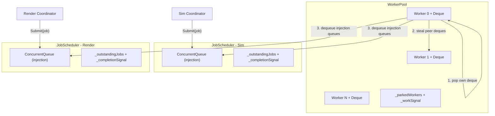

# Split JobScheduler into WorkerPool + JobScheduler

## Architecture




## New file: `WorkerPool.cs`

Extracted from current `JobScheduler.cs`. Owns the "hardware":

- **Fields**: `_allContexts` (length = workerCount, no submission slot), `_workerThreads`, `_workerCount`, `_workSignal`, `_parkedWorkers`, `_shutdownRequested`, `_disposed`
- **Injection queue registry**: `volatile ConcurrentQueue<Job>[]? _injectionQueues` — schedulers register their queue on construction. Uses copy-on-write array swap (registration happens once at startup, not on hot path).
- **Worker loop** (`RunWorker`): same announce-then-recheck pattern
- `**TryExecuteOne`**: 1) pop own deque, 2) steal peer deques, 3) dequeue from injection queues
- `**ExecuteJob**`: reads `job._scheduler` to set `context._currentScheduler`, calls `Execute`, calls `PropagateCompletion`, decrements `job._scheduler.DecrementOutstanding()`
- `**PropagateCompletion**`: stamps `dependent._scheduler = context._currentScheduler`, increments that scheduler's outstanding count
- `**NotifyWorkAvailable**`: same `_parkedWorkers` guard as today
- `**MaxWorkerCount = 127**`, minimum 1
- `**Dispose**`: shutdown flag, wake workers, join, dispose semaphore

## Slimmed `JobScheduler.cs`

Lightweight per-DAG completion tracker:

- **Constructor**: `JobScheduler(WorkerPool pool)` — creates `ConcurrentQueue<Job>`, registers it with pool
- **Fields**: `_pool`, `_injectionQueue`, `_outstandingJobs`, `_completionSignal`
- `**Submit(Job job)`**: debug-assert `_outstandingJobs == 0` (no second DAG while one is in flight), stamps `job._scheduler = this`, increments outstanding, enqueues to `_injectionQueue`, calls `pool.NotifyWorkAvailable()`
- `**WaitForCompletion**`: same reset-recheck-wait pattern on `_completionSignal`
- `**IncrementOutstanding` / `DecrementOutstanding**`: called by WorkerPool infrastructure; `DecrementOutstanding` signals `_completionSignal` when hitting zero
- **No threads, no deques, no worker loop**

## Changes to `Job.cs`

- Add field: `internal JobScheduler? _scheduler;`
- This is the "which DAG does this belong to" tag, set at submit time, inherited by sub-jobs and propagated dependents

## Changes to `WorkerContext.cs`

- Constructor parameter changes from `JobScheduler` to `WorkerPool`
- Add field: `internal JobScheduler? _currentScheduler;` — set by `ExecuteJob` before `Execute`, cleared after. Scoped to execution lifetime.
- `**Enqueue`**: reads `_currentScheduler` to stamp `job._scheduler` and increment outstanding count; calls `pool.NotifyWorkAvailable()`

## Changes to `JobPool.cs`

- `Return`: also clears `item._scheduler = null;`

## Worker execution priority

1. **Pop own deque** (LIFO — cache-hot sub-jobs)
2. **Steal peer deques** (FIFO — redistribute work)
3. **Dequeue injection queues** (cold — newly submitted top-level jobs)

This naturally prioritizes locally-generated work over externally-submitted work, matching the standard pattern (Java ForkJoinPool, Tokio).

## `_allContexts` simplification

The submission slot (`_allContexts[_workerCount]`) is removed. The array is now exactly `workerCount` elements — only real worker contexts. Submission goes through injection queues, not a Chase-Lev deque.

## Test changes

All tests in [JobSchedulerTests.cs](tests/Fabrica.Core.Tests/Jobs/JobSchedulerTests.cs) change from:

```csharp
using var scheduler = new JobScheduler(workerCount: 2);
```

to:

```csharp
using var pool = new WorkerPool(workerCount: 2);
using var scheduler = new JobScheduler(pool);
```

Add new tests:

- Two schedulers sharing one pool, both submit + wait concurrently
- Debug assert fires if Submit called while DAG is in flight

TestAccessor moves to WorkerPool (worker contexts are there). JobScheduler gets a simpler accessor for outstanding count.