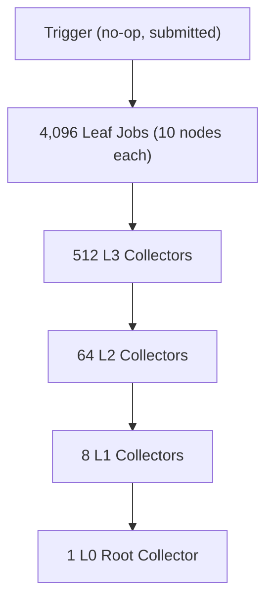
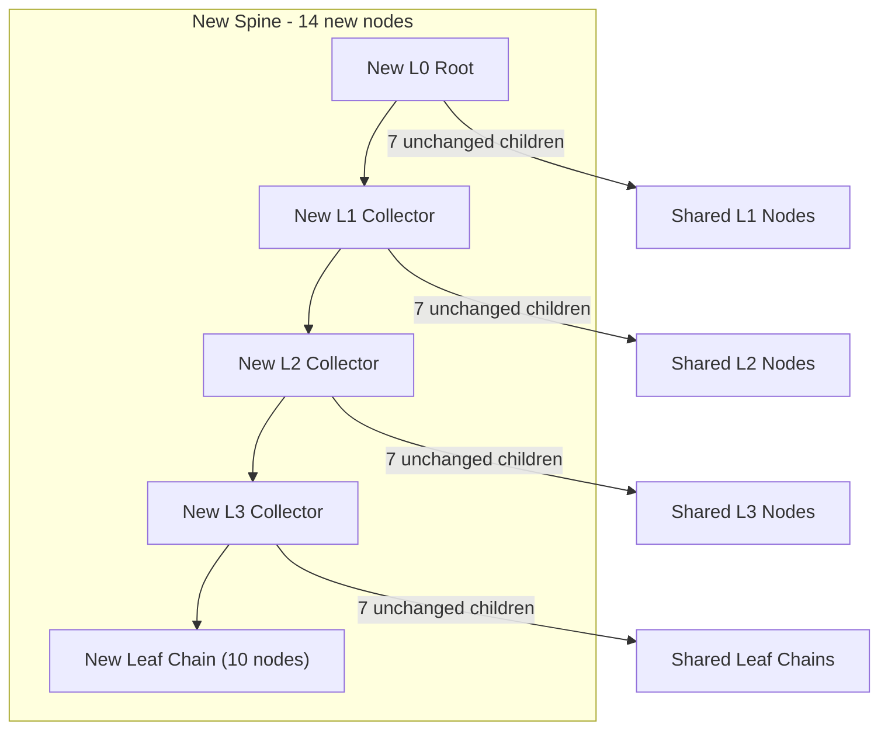

# Large-Scale Tick Benchmarks + CPU Profiling

## Shared types (all in the benchmark project)

### `BenchNode` struct (single node type for the whole tree)

```csharp
[StructLayout(LayoutKind.Sequential)]
struct BenchNode
{
    public Handle<BenchNode> Child0, Child1, Child2, Child3;
    public Handle<BenchNode> Child4, Child5, Child6, Child7;
    public Handle<BenchNode> Next;  // chain link for leaf nodes
    public int Value;
}
```

### `BenchNodeOps` struct — implements `INodeOps<BenchNode>`

Enumerates all 9 possible children (Child0-7 + Next). `IncrementChildRefCounts` increments for each valid child in the single `GlobalNodeStore<BenchNode, BenchNodeOps>`.

### Job types

- `**TriggerJob**` — no-op, no deps. All 4,096 leaf jobs call `DependsOn(trigger)`. When trigger completes, `PropagateCompletion` fans out all leaves.
- `**LeafJob**` — creates 10 `BenchNode`s chained via `Next`. Stores `ResultHead` for parent collector.
- `**CollectorJob**` — depends on 8 child jobs (either `LeafJob` or `CollectorJob` — both expose `ResultHead` via a shared base class `TreeJob : Job`). Creates 1 `BenchNode` with `Child0-7` pointing to children's heads. Marks its own node as root only at L0.
- `**SpineUpdateJob**` — single job for the incremental benchmark. Reads the current tree from the arena, creates 10 new chain nodes + 4 new collector nodes along one path, referencing existing global handles for unchanged siblings.

---

## Benchmark 1: `FullRebuildBenchmark` — complete tree rebuild each tick

### Workload shape

- **Fan-out:** 8 at each level
- **Depth:** 5 levels (L0 root through L4 leaves)
- **Jobs per tick:** 1 trigger + 4,096 leaves + 512 L3 + 64 L2 + 8 L1 + 1 L0 = **4,682**
- **Nodes per tick:** 4,096 x 10 chain + 585 collectors = **41,545**
- **On release:** all ~41K nodes freed back to free-list (entire previous tree replaced)




**Execution flow per tick:**

1. Reset and re-wire all 4,682 pre-allocated jobs.
2. Submit trigger job. On completion, all 4,096 leaves become ready.
3. Leaves create 10 chained nodes each in their worker's TLB.
4. Collectors cascade upward (L3 -> L2 -> L1 -> L0), each creating 1 node referencing 8 children's heads.
5. Merge pipeline: drain TLBs, rewrite handles, increment refcounts, build snapshot slice.
6. Release previous tick's snapshot — cascading refcount decrement frees all ~41K nodes.

All 4,682 jobs pre-allocated once. `Reset()` + `DependsOn` re-wiring each tick. **Zero allocation in steady state.**

---

## Benchmark 2: `IncrementalUpdateBenchmark` — persistent spine update each tick

### Workload shape

- **Initial build:** same 41,545-node tree (built once in `[GlobalSetup]`)
- **Per tick:** 1 job creates 14 new nodes (10 chain + 4 spine collectors)
- **On release:** 14 old spine+chain nodes freed, ~41,531 shared nodes untouched
- **Net effect:** structural sharing — only the changed path is replaced




**Execution flow per tick:**

1. `SpineUpdateJob` picks a deterministic path (rotating through leaves for coverage).
2. Reads existing collector nodes from the arena to copy unchanged Child0-7 references.
3. Creates 10 new leaf chain nodes + 4 new collector nodes in the TLB, referencing existing global handles for the 7 unchanged siblings at each level.
4. Marks the new root as a root handle.
5. Merge: drain 14 nodes, rewrite local handles, increment refcounts (including shared children — their counts go up by 1).
6. Build snapshot slice (new root).
7. Release old snapshot — old root cascade frees 14 old spine nodes. Shared children lose 1 refcount but stay alive (new snapshot still references them).

Single pre-allocated `SpineUpdateJob`, `Reset()` each tick. **Zero allocation in steady state.**

---

## Phases

1. **Build shared types** — `BenchNode`, `BenchNodeOps`, job classes
2. **Build `FullRebuildBenchmark`** — pre-allocated 4,682-job DAG, full tick cycle
3. **Build `IncrementalUpdateBenchmark`** — initial tree build + 14-node spine update per tick
4. **Run for raw numbers** — `dotnet run -c Release -- --filter "*Rebuild*" "*Incremental*"`, verify 0 B allocated, collect mean/stddev
5. **Collect CPU traces** — add `[EventPipeProfiler(EventPipeProfile.CpuSampling)]`, run again
6. **Analyze and report** — break down both profiles by phase, identify hotspots (>1% threshold), propose targeted optimizations

