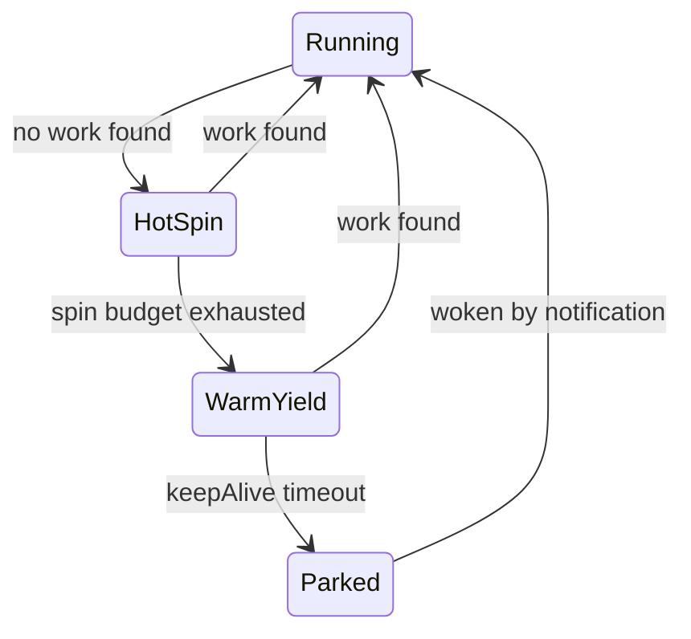

# Adaptive Worker Parking

## Background / Research

Three state-of-the-art approaches inform this design:

- **Tokio (Rust async runtime)**: Workers have 3 states: running, searching, parked. Two key optimizations:
  1. **Only wake if nobody is searching**: `worker_to_notify()` returns `None` if `num_searching > 0` -- a searching worker will eventually find the new work. Source: `[idle.rs:worker_to_notify](https://github.com/tokio-rs/tokio/blob/master/tokio/src/runtime/scheduler/multi_thread/idle.rs)` and the `notify_should_wakeup` helper which checks `state.num_searching() == 0 && state.num_unparked() < self.num_workers`.
  2. **Cascade wake ("notify then search")**: When a worker finds work and transitions out of searching, if it was the *last* searching worker, it wakes exactly ONE parked worker. That woken worker searches, and if it finds surplus work and is again the last searcher, it wakes one more. This creates a chain that naturally scales to the workload without thundering herd. Source: `[worker.rs:transition_worker_from_searching](https://github.com/tokio-rs/tokio/blob/master/tokio/src/runtime/scheduler/multi_thread/worker.rs)` -- "We are the final searching worker. Because work was found, we need to notify another worker."
  3. **Searcher limit**: At most ~50% of workers can be in searching state simultaneously, reducing steal contention. Source: `[idle.rs:transition_worker_to_searching](https://github.com/tokio-rs/tokio/blob/master/tokio/src/runtime/scheduler/multi_thread/idle.rs)` -- `if 2 * state.num_searching() >= self.num_workers { return false; }`
- **.NET ThreadPool**: Uses a hill-climbing algorithm that measures throughput and adjusts thread count every 500ms. Too heavy for a latency-sensitive game engine. Source: [Matt Warren's analysis](http://www.mattwarren.org/2017/04/13/The-CLR-Thread-Pool-Thread-Injection-Algorithm/)
- **Game engines (Unity, Unreal, Naughty Dog)**: Pure spin-wait. Workers never park. Lowest latency, highest power draw.

Our design takes Tokio's cascade-wake insight and combines it with a game-engine-friendly graduated spin strategy.

## Design

### Worker State Machine




**Running**: Executing jobs (pop own deque, steal from peers, drain injection queue).

**HotSpin**: Pure CPU spin via `Thread.SpinWait` for ~10 iterations. Sub-microsecond response. Catches most inter-phase DAG gaps.

**WarmYield**: `Thread.Yield()` loop for up to `KeepAliveMs` (default: 1000ms). Gives up timeslice but stays on run queue. Much cheaper than hot spin but still responsive within ~1 yield-reschedule cycle. During active gameplay (work every ~16ms), workers never leave this phase.

**Parked**: Blocked on `ManualResetEventSlim` until explicitly woken. Zero CPU. For truly idle periods (loading screen, pause menu). Once woken, returns to Running and the full keepAlive window resets.

### Cascade Wake Policy (adapted from Tokio's "notify then search")

Track two atomic counters packed into a single `int` (like Tokio's `State`):

- `_numSearching`: workers in HotSpin or WarmYield (actively looking for work)
- `_numUnparked`: workers NOT in Parked state (Running + HotSpin + WarmYield)

**When new work arrives** (in `PropagateCompletion` or `NotifyWorkAvailable`):

```
if (numSearching > 0):
    return  // a searching worker will find this work
if (numUnparked < _backgroundWorkerCount):
    wake exactly ONE parked worker
```

Only wake 1 worker, and only if nobody is already searching. This is the key insight from Tokio.

**When a worker finds work and leaves "searching" state** (transitions from HotSpin/WarmYield to Running):

```
wasLastSearcher = atomicDecrement(numSearching) == 1
if (wasLastSearcher):
    wake ONE more parked worker  // cascade
```

If this worker was the last one searching, wake one more so there's always at least one searcher while work exists. This creates a natural cascade: 1 worker wakes, searches, finds work, wakes 1 more, etc. The chain stops when a woken worker searches and finds nothing (no more surplus work).

**Why this handles partial load correctly**: In a factory game with 20 jobs per tick handled by 4 workers, the other 11 workers park after the keepAlive timeout. When the next tick arrives:

1. 4 active workers (in WarmYield) find the work immediately -- `numSearching > 0`, so no parked workers wake
2. The 11 parked workers stay parked
3. Only if the 4 active workers can't keep up (all executing, `numSearching == 0`) does one parked worker wake, and then only one more if needed

### Changes to `WorkerPool.cs`

The only production file that changes is [WorkerPool.cs](src/Fabrica.Core/Jobs/WorkerPool.cs).

**Remove**: `_workSignal` (SemaphoreSlim), `_parkedWorkers`

**Add**:

- `_idleState` (int, Interlocked) -- packed `(numUnparked << 16) | numSearching`, matching Tokio's `State` layout
- `_workerEvents` (ManualResetEventSlim[]) -- one per background worker, for targeted park/wake
- `_sleepers` (ConcurrentStack of int) -- indices of parked workers (pop to wake)
- `KeepAliveMs` constant (1000ms default)

**RunWorker** becomes:

```csharp
private void RunWorker(WorkerContext context)
{
    IncrementUnparked(searching: false);
    try
    {
        while (!_shutdownRequested)
        {
            // -- Running: execute from own deque / steal / injection --
            if (TryExecuteOne(context))
            {
                // We found work. If we were searching, transition out and
                // potentially cascade-wake one parked worker.
                TransitionFromSearchingIfNeeded(context);
                continue;
            }

            // -- HotSpin: ~10 pure CPU spin iterations --
            EnterSearching(context);
            var spinWait = new SpinWait();
            bool found = false;
            while (!spinWait.NextSpinWillYield)
            {
                spinWait.SpinOnce();
                if (TryExecuteOne(context)) { found = true; break; }
            }
            if (found) { TransitionFromSearchingIfNeeded(context); continue; }

            // -- WarmYield: Thread.Yield() for up to KeepAliveMs --
            var deadline = Environment.TickCount64 + KeepAliveMs;
            while (Environment.TickCount64 < deadline)
            {
                Thread.Yield();
                if (_shutdownRequested) return;
                if (TryExecuteOne(context)) { found = true; break; }
            }
            if (found) { TransitionFromSearchingIfNeeded(context); continue; }

            // -- Park: deep sleep until explicitly woken --
            LeaveSearching(context);
            TransitionToParked(context);   // dec numUnparked, push to sleepers

            if (TryExecuteOne(context))    // recheck after announcing
            {
                TransitionFromParked(context); // undo park
                continue;
            }

            _workerEvents[context.WorkerIndex].Wait();
            _workerEvents[context.WorkerIndex].Reset();
            TransitionFromParked(context);
        }
    }
    finally
    {
        DecrementUnparked(searching: false);
    }
}
```

**Notification** (in `PropagateCompletion` and `NotifyWorkAvailable`):

```csharp
private void TryWakeOneWorker()
{
    // Tokio's rule: if anyone is already searching, they'll find the work.
    var state = LoadIdleState();
    if (state.NumSearching > 0)
        return;
    if (state.NumUnparked >= _backgroundWorkerCount)
        return;

    // Nobody searching and someone is parked -- wake exactly one.
    if (_sleepers.TryPop(out var workerIndex))
    {
        IncrementUnparked(searching: true);  // woken worker starts as searcher
        _workerEvents[workerIndex].Set();
    }
}
```

**Cascade**: When a worker transitions from searching to running (found work), if it was the last searcher, it calls `TryWakeOneWorker()` to keep the search chain alive. This is the "notify then search" pattern from Tokio.

### Correctness Argument

- **No lost wakes**: The announce-then-recheck pattern is preserved. Before parking, the worker decrements `numUnparked` (announce) and pushes itself to `_sleepers`, then rechecks `TryExecuteOne`. If a producer published work before the recheck, the worker finds it. If a producer publishes work after the recheck, the producer sees `numSearching == 0` and `numUnparked < total`, pops the sleeper, and wakes it.
- **No thundering herd**: At most ONE parked worker is woken per notification. The cascade mechanism wakes additional workers only when the previous woken worker finds surplus work and transitions out of searching.
- **Partial load scales naturally**: If 4 workers handle the workload, the other 11 park after the keepAlive timeout. New work arrives and 4 yielding workers (counted as searching) find it -- `numSearching > 0` means no parked worker is woken. Only when all 4 are busy executing does `numSearching` drop to 0, triggering one wake.
- **No unbounded spinning during idle**: Workers park after `KeepAliveMs` (1s) of no work. CPU goes to zero. Handles loading screens, menus, or simply a game that doesn't need many cores.
- **Shutdown**: Set `_shutdownRequested`, set all worker events, join threads.

### What This Achieves


| Scenario                            | Behavior                              | Wake Latency          |
| ----------------------------------- | ------------------------------------- | --------------------- |
| Active gameplay (work every 16ms)   | Workers never park, stay in WarmYield | Sub-yield (~1-10us)   |
| Phase transition gap (~100-300us)   | HotSpin catches most                  | Sub-us                |
| Brief idle (< 1s)                   | WarmYield absorbs it                  | Sub-yield             |
| True idle (menus, loading)          | Workers park after 1s                 | Event wake (~10-50us) |
| Partial load (8 of 16 cores enough) | Unneeded workers park, stay parked    | Only woken if needed  |


### Testing

- All existing tests should pass (the core TryExecuteOne/steal/inject logic is unchanged)
- Verify RealisticTickBenchmark shows improvement over both spin-only and hybrid
- Verify that after 2 seconds of no work, all workers are parked (zero CPU)
- Verify that partial-load scenarios don't wake excess workers

