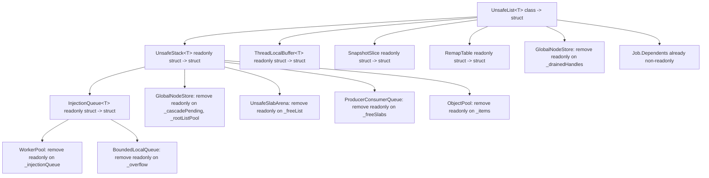

# Convert UnsafeList&lt;T&gt; to Mutable Struct

## Why this matters

Every `UnsafeList<T>` is currently a heap-allocated class. On hot paths (Push/Pop/Add/index), this means an extra pointer dereference to reach `_array` and `_count`. Converting to a struct embeds those fields inline in the parent, removing one pointer hop everywhere.

## Critical safety rule

A struct `UnsafeList<T>` has `_array` (a `T[]` reference) and `_count` (a value-type int). **Copies are catastrophic**: two copies share `_array` but have independent `_count` values, and after a `Grow()` they become fully disconnected. The rule is absolute: **never copy, always use `ref` or store in a single location.**

## Cascade chain

## Changes by file

### Layer 1: Core types

- **`UnsafeList.cs`**: `sealed class` -> `struct`. Remove default param from constructor (same pattern as UnsafeStack). Add `static Create()` factory. Update aliasing warning in docs.

- **`UnsafeStack.cs`**: `readonly struct` -> `struct`. Field `readonly UnsafeList<T> _list` -> `UnsafeList<T> _list`. Update aliasing warning.

### Layer 2: Types that hold UnsafeList directly

- **`ThreadLocalBuffer.cs`** (line 23): `readonly struct` -> `struct`. Fields `_list`, `_roots` lose `readonly`.
- **`SnapshotSlice.cs`** (line 34): `readonly struct` -> `struct`. Field `_rootHandles` loses `readonly`.
- **`RemapTable.cs`** (line 16): `readonly struct` -> `struct`. The array `_perThreadMappings` stays `readonly` (it's a `UnsafeList<int>[]` — the array ref doesn't change, but elements are mutated by ref via indexer).
- **`GlobalNodeStore.cs`** (line 113): `_drainedHandles` loses `readonly`.
- **`Job.cs`** (line 34): `Dependents` is already non-readonly — no change needed.

### Layer 3: Types that hold UnsafeStack

- **`InjectionQueue.cs`** (line 18): `readonly struct` -> `struct`. Field `_stack` loses `readonly`. `_lock` stays `readonly` (it's a class ref).
- **`GlobalNodeStore.cs`** (lines 92, 100): `_cascadePending`, `_rootListPool` lose `readonly`.
- **`UnsafeSlabArena.cs`** (line 48): `_freeList` loses `readonly`.
- **`ProducerConsumerQueue.cs`** (line 85): `_freeSlabs` loses `readonly`.
- **`ObjectPool.cs`** (line 31): `_items` loses `readonly`.

### Layer 4: Types that hold InjectionQueue

- **`WorkerPool.cs`** (line 158): `_injectionQueue` loses `readonly`.
- **`BoundedLocalQueue.cs`** (line 148): `_overflow` loses `readonly`.

### Layer 5: Method parameters (pass-by-ref audit)

These methods accept `UnsafeList` or `UnsafeStack` by value and mutate them. They must become `ref` parameters:

- **`UnsafeSlabArena.AllocateBatch(int count, UnsafeList<Handle<T>> destination)`** -> `ref UnsafeList<Handle<T>> destination`
- **`GlobalNodeStore.CollectAndRemapRoots(UnsafeList<Handle<TNode>> destination)`** -> `ref UnsafeList<Handle<TNode>> destination`
- **`GlobalNodeStore.TestAccessor.CollectAndRemapRoots(...)`** -> same
- **`GlobalNodeStore.TestAccessor.BuildSnapshotSlice(UnsafeList<Handle<TNode>> roots)`** -> pass by value is OK here (read-only consumption), but verify
- **`RefCountTable.DecrementBatch(..., UnsafeStack<Handle<T>> hitZero)`** -> `ref UnsafeStack<Handle<T>> hitZero`
- **`SnapshotSlice.DetachRoots()`** returns `UnsafeList<Handle<TNode>>` — returns a copy of the struct. Since the caller takes ownership, this may be fine, but verify at call site.

### Layer 6: Construction sites

All `new UnsafeList<T>()` (parameterless) in production code must become `UnsafeList<T>.Create()` or explicit `new UnsafeList<T>(capacity)` to avoid the struct default-init trap:

- `GlobalNodeStore.cs` line 113, 305
- `RemapTable.cs` line 25
- `Job.cs` line 62 (already has capacity: `new UnsafeList<Job>(4)` — OK)
- Test files: ~50+ sites (bulk find-replace)

### Layer 7: Test and benchmark updates

- **`UnsafeListTests.cs`**: Update all `new UnsafeList<T>()` to factory or explicit capacity.
- **`UnsafeStackTests.cs`**: Already uses `Create()` — verify.
- **`RefCountTableTests.cs`**: Update `UnsafeStack` usage in `DecrementBatch` tests.
- **Various integration tests**: Update construction patterns.
- **Benchmark files**: `RefCountTableBenchmarks.cs`, `PersistentTreeBenchmarks.cs` — update UnsafeStack construction.

## What does NOT change

- **`RefCountTable<T>`**: remains `readonly struct` — it holds `UnsafeSlabDirectory<int>` (a class), not UnsafeList/UnsafeStack.
- **`BoundedLocalQueue<T>`**: already a plain `struct` — just loses `readonly` on `_overflow`.
- **`InjectionQueue.TestAccessor`**: takes the queue by value for read-only inspection — may need `ref` if it mutates.
